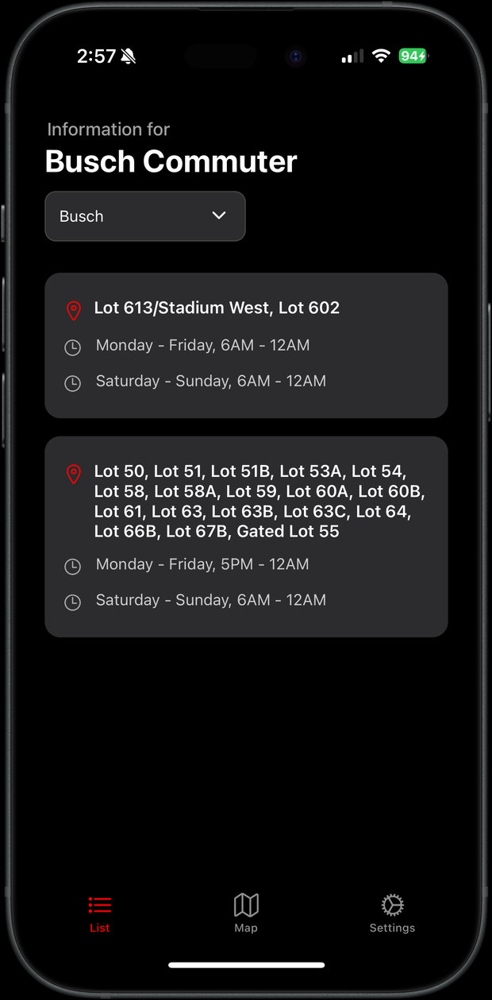
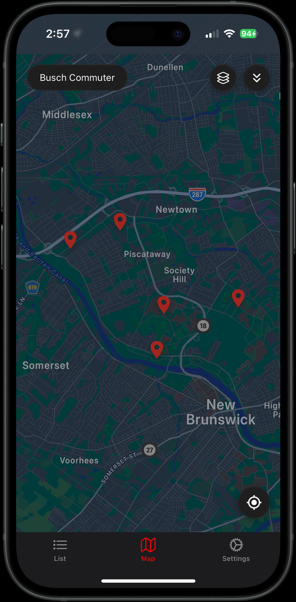
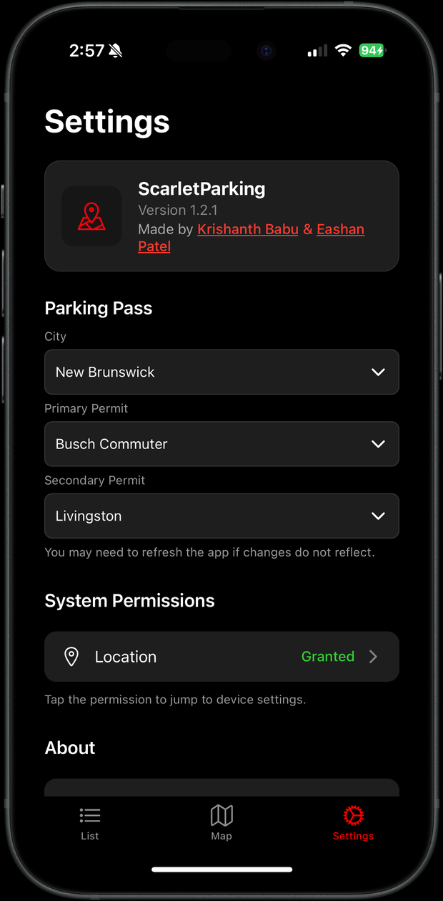

# ScarletParking

**Know exactly where your Rutgers parking permit is valid**

---

## About

Rutgers publishes parking eligibility as a sprawl of PDFs: dozens of permit types, five campuses, hundreds of numbered lots, and per-lot time windows that shift by day of week. Figuring out whether you can legally park in Lot 60B at 4:45 PM on a Tuesday means cross-referencing several documents while sitting in your car.

ScarletParking solves this in one app. Pick your permit once, and the app shows only the lots you're allowed to park in — on an interactive map and in a searchable list — filtered against the current day and time.

**Live on the App Store:** [apps.apple.com/us/app/scarletparking](https://apps.apple.com/us/app/scarletparking/id6744491108)

---

## Screenshots

| List View | Map View | Settings |
|:---:|:---:|:---:|
|  |  |  |
| Every eligible lot grouped by campus, with the exact weekday and weekend windows each one is open to your permit. | Only the lots valid *right now* appear as pins. Tap one for its hours and turn-by-turn directions. | Set your campus and permit once. Holders of two permits can configure a secondary pass as well. |

---

## Features

**Permit-aware filtering**: Choose from 30+ permit types across New Brunswick, Newark, Camden, and Rutgers Health. Every screen in the app reflects that choice.

**Time-aware map**: A lot only shows up as a pin when your permit is actually valid there at that moment. Lot 60B disappears from the map at 5:59 PM and appears at 6:00 AM.

**"Set Time" planning mode**: Check eligibility for a future time instead of the current one. Useful before an evening class or a weekend event.

**Marker clustering**: All of Rutgers' lots on one map would be an unreadable mess of pins, so nearby markers collapse into counted clusters and expand as you zoom.

**One-tap directions**: Selecting a lot hands its coordinates straight to Apple Maps.

**Location awareness**: Your live position is drawn on the map so you can judge which valid lot is actually closest.

---

## Impact

- **Top 100** in Apple's Navigation category
- **12,000+** App Store impressions
- **1,500+** downloads
- **5-star** average rating

---

## Authors

Built by Krishanth Babu and Eashan Patel.

## Disclaimer

ScarletParking is an independent project and is not affiliated with, endorsed by, or maintained by Rutgers University. Parking rules change — always confirm against posted signage and [Rutgers Department of Transportation Services](https://ipo.rutgers.edu/dots) before parking.

## License

Released under the [0BSD](https://opensource.org/license/0bsd) license.
